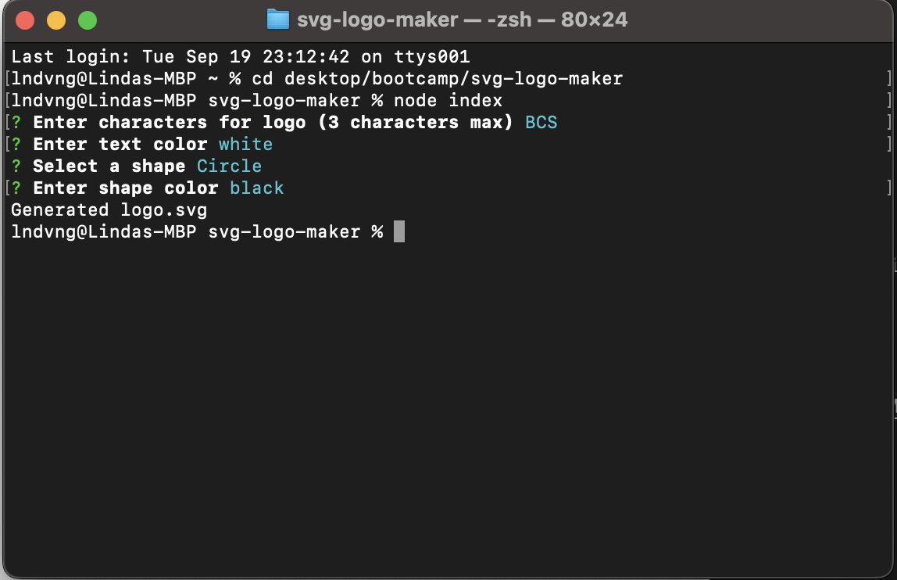
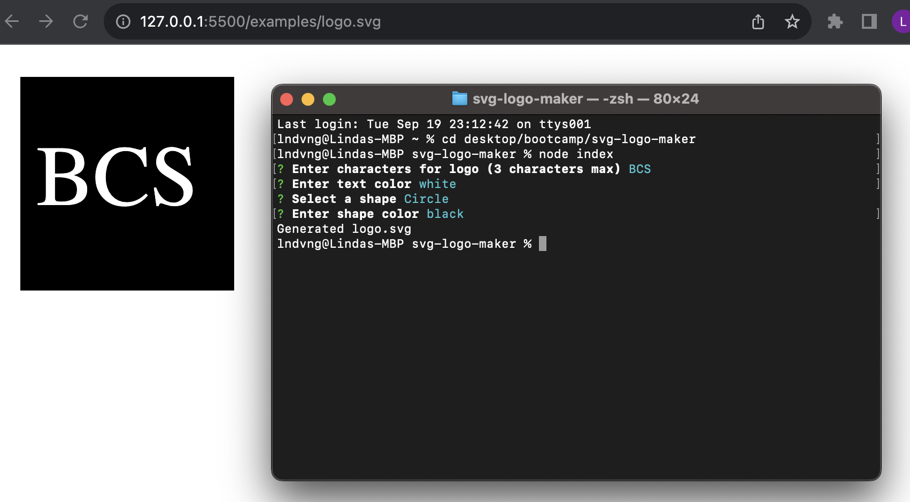

# README Generator
  
## Description
The motive behind this project was to create an SVG logo generator. It will save the user a ton of time creating their own logo. I learned how to create a function that renders SVG input from user, a function to write the SVG file, and a function to initialize the app.
 
## Installation
1. Clone from repo.
2. Open folder with visual studio code or any text editor of choice.
3. Run ‘node index ‘in terminal to run code.

## Usage
1. Open repo in terminal.
2. Run ‘node index’ to start application
3. Answer prompts accordingly

4. SVG logo will be generated after all prompts are answered onto logo.svg file.

## Video Demo Link
[Click here for Demo Video](https://drive.google.com/file/d/1qUlFFEgTOB4xCQcMB87gQ11zCIWD3SKT/view)